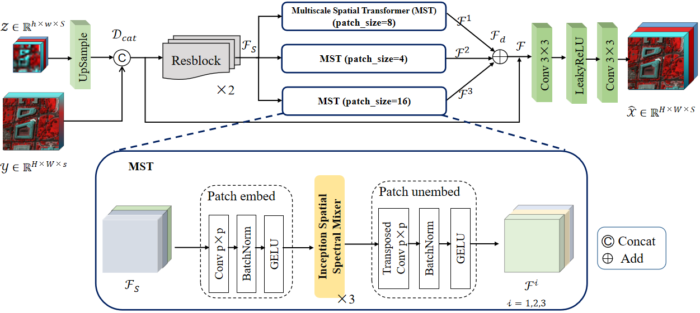
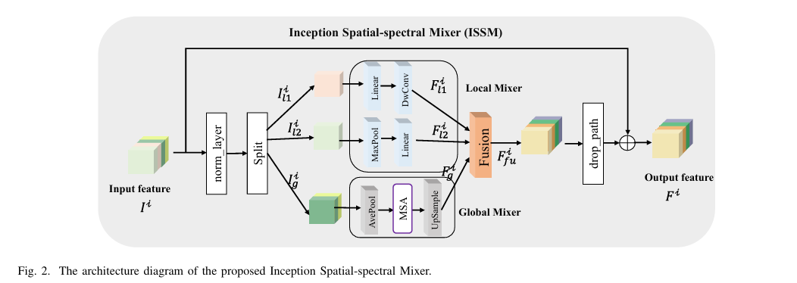

# MIMFormer:Multiscale Inception Mixer Transformer for  Hyperspectral and Multispectral Image Fusion(JSTARS)

## Network Architecture

- The overall architecture diagram of our proposed MIMFormer network.
  

- The architecture diagram of the Inception Spatial Spectral Mixer.
  

## 1. Create Envirement:

- Python 3 (Recommend to use [Anaconda](https://www.anaconda.com/download/#linux))
- NVIDIA GPU + [CUDA](https://developer.nvidia.com/cuda-downloads)

Simply use the "pip install" command to install the following packages:

- timm
- thop
- scikit-image
- scipy
- einops
- opencv-python
- tensorboard

## 2. Data Preparation:

- Download the CAVE dataset from <a href="https://www1.cs.columbia.edu/CAVE/databases/multispectral">here</a>.
- Download the PU dataset from <a href="[Hyperspectral Remote Sensing Scenes - Grupo de Inteligencia Computacional (GIC) (ehu.eus)](https://www.ehu.eus/ccwintco/index.php/Hyperspectral_Remote_Sensing_Scenes)">here</a>.
- Download the WDCM dataset from <a href="[MSST-Net/README.md at main · jx-mzc/MSST-Net · GitHub](https://github.com/jx-mzc/MSST-Net/blob/main/README.md)">here</a>.
-  the real remote sensing dataset ZY1E, which was used in this study, has been completely uploaded and can be accessed through the following link: [https://pan.baidu.com/s/10KHvZowrlPpB3nFlyRRt3g code: ZY1E](). The extraction code to access the dataset is 7g68, and it is publicly available

## 3. How to do

Place the data files into the "Datasets" folder. Simply run the "main.py" file to execute.

## 4. Attention
This repository is based on the excellent work of  [SSRNET](https://github.com/hw2hwei/SSRNET) and [3DT-Net](https://github.com/qingma2016/3DT-Net).

If you have any questions, please feel free to contact me.    Email:2220902206@cnu.edu.cn

## 5. Citation
If this repo helps you, please consider citing our works:
> @ARTICLE{10643657,
 > author={Li, Rumei and Zhang, Liyan and Wang, Zun and Li, Xiaojuan},
 > journal={IEEE Journal of Selected Topics in Applied Earth Observations and Remote Sensing},
 > title={MIMFormer:Multiscale Inception Mixer Transformer for Hyperspectral and Multispectral Image Fusion},
 > year={2024},
> 
 > volume={},
> 
 > number={},
> 
 > pages={1-14},
> 
 > keywords={Hyperspectral image (HSI);multispectral image (MSI);image fusion;deep learning;Transformer},
> 
 > doi={10.1109/JSTARS.2024.3447648}}
