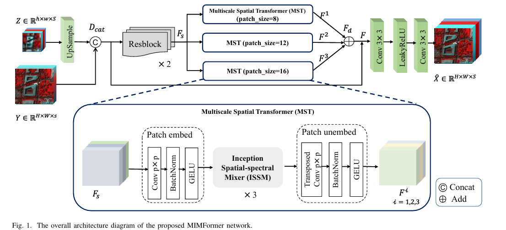

# MIMFormer:Multiscale Inception Mixer Transformer for  Hyperspectral and Multispectral Image Fusion(JSTARS)

## Network Architecture

- The overall architecture diagram of our proposed MIMFormer network.
  

- The architecture diagram of the Inception Spatial Spectral Mixer.
  

## 1. Create Envirement:

- Python 3 (Recommend to use [Anaconda](https://www.anaconda.com/download/#linux))
- NVIDIA GPU + [CUDA](https://developer.nvidia.com/cuda-downloads)
open the anaconda prompt 
- conda create -n MIMFormer python=3.8
- pip3 install torch torchvision torchaudio --index-url https://download.pytorch.org/whl/cu118

Simply use the "pip install" command to install the following packages:

- pip install timm -i https://pypi.tuna.tsinghua.edu.cn/simple
- pip install thop -i https://pypi.tuna.tsinghua.edu.cn/simple
- pip install scikit-image -i https://pypi.tuna.tsinghua.edu.cn/simple
- pip install scipy -i https://pypi.tuna.tsinghua.edu.cn/simple
- pip install einops -i https://pypi.tuna.tsinghua.edu.cn/simple
- pip install opencv-python -i https://pypi.tuna.tsinghua.edu.cn/simple
- pip install tensorboard -i https://pypi.tuna.tsinghua.edu.cn/simple

## 2. Data Preparation:

- Download the CAVE dataset from <a href="https://www.cs.columbia.edu/CAVE/databases/multispectral">here</a> or CAVE.zip https://pan.baidu.com/s/1dL0eOwSugFsn7tChCuGLsw code: hskt.
- Download the PU dataset from <a href="https://www.ehu.eus/ccwintco/index.php/Hyperspectral_Remote_Sensing_Scenes">here</a>.
- Download the WDCM dataset from <a href="https://github.com/jx-mzc/MSST-Net/blob/main/README.md">here</a>.
-  the real remote sensing dataset ZY1E, which was used in this study, has been completely uploaded and can be accessed through the following link: [ZY1E](https://pan.baidu.com/s/10KHvZowrlPpB3nFlyRRt3g). The extraction code to access the dataset is ZY1E, and it is publicly available

## 3. How to do

Place the data files into the "Datasets" folder. Simply run the "main.py" file to execute.
tensorboard --logdir==tf-logs

## 4. Attention
This repository is based on the excellent work of  [SSRNET](https://github.com/hw2hwei/SSRNET) and [3DT-Net](https://github.com/qingma2016/3DT-Net).

If you have any questions, please feel free to contact me.    Email:2220902206@cnu.edu.cn

## 5. Citation
If this repo helps you, please consider citing our works:
https://doi.org/10.1109/JSTARS.2024.3447648
